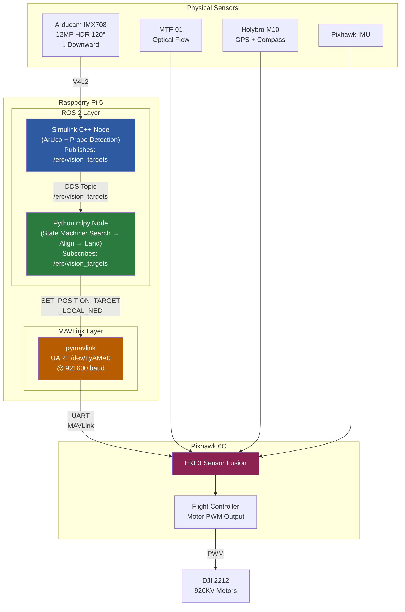

# 🛩️ Raspberry Pi 5 — ROS 2 Jazzy Configuration Guide
## ERC 2026 Droning Sub-Task — Hybrid ROS-Simulink-Python Architecture

> [!IMPORTANT]
> This guide walks you through **every step** from OS preparation to a fully validated ROS 2 Jazzy environment on your Raspberry Pi 5, ready to receive Simulink-generated C++ nodes and run your Python `rclpy` state machine alongside the existing `pymavlink` flight controller.

---

## Table of Contents
1. [FAQ — Common Questions Answered First](#1-faq--common-questions-answered-first)
2. [Prerequisites & What You Need](#2-prerequisites--what-you-need)
3. [Phase 1 — OS Preparation](#3-phase-1--os-preparation)
4. [Phase 2 — Pre-Script System Configuration](#4-phase-2--pre-script-system-configuration)
5. [Phase 3 — Running the ROS 2 Installation Script](#5-phase-3--running-the-ros-2-installation-script)
6. [Phase 4 — Post-Installation Verification](#6-phase-4--post-installation-verification)
7. [Phase 5 — Installing rclpy & Python ROS 2 Bindings](#7-phase-5--installing-rclpy--python-ros-2-bindings)
8. [Phase 6 — Integrating with Your Existing Project](#8-phase-6--integrating-with-your-existing-project)
9. [Phase 7 — MATLAB/Simulink Raspberry Pi Blockset Setup](#9-phase-7--matlabsimulink-raspberry-pi-blockset-setup)
10. [Architecture Diagram — Full Data Flow](#10-architecture-diagram--full-data-flow)
11. [Common Pitfalls & Troubleshooting](#11-common-pitfalls--troubleshooting)
12. [Quick Reference Cheat Sheet](#12-quick-reference-cheat-sheet)

---

## 1. FAQ — Common Questions Answered First

### ❓ Do I need a different OS than standard Raspberry Pi OS?

**It depends on which version you currently have installed:**

| Your Current OS | `VERSION_CODENAME` | Action Required |
|---|---|---|
| Raspberry Pi OS (2026, latest) | `trixie` (Debian 13) | ✅ **No action needed** — you're already on the right OS |
| Raspberry Pi OS (2024–2025) | `bookworm` (Debian 12) | ❌ **You must upgrade or re-flash** — the script explicitly checks for `trixie` and will abort |
| Raspberry Pi OS (older) | `bullseye` (Debian 11) | ❌ **You must re-flash** — clean install required |
| Ubuntu 24.04 for Pi | `noble` | ❌ **Will not work** — the rospian repository targets Trixie specifically |

**How to check your current version:**
```bash
cat /etc/os-release | grep VERSION_CODENAME
```

If the output is `VERSION_CODENAME=trixie`, you are good to go. If it says `bookworm` or anything else, you need to re-flash.

> [!WARNING]
> **Do NOT attempt an in-place `apt dist-upgrade` from Bookworm to Trixie.** While technically possible, it frequently breaks packages, kernel modules, and camera drivers on the Pi 5. A clean re-flash is the only reliable path and takes 15 minutes vs. hours of debugging.

### ❓ If I re-flash, will I lose my existing project files?

Yes, re-flashing wipes the SD card. **Before re-flashing:**
1. Back up your entire project directory (`~/drone_autonomy_project` or wherever your code lives).
2. Back up any custom ArduCopter parameter files, camera calibration data (`camera_calibration.npz`), and Mission Planner configurations.
3. Your code is on Git (`UCUSpaceRobotics/indomitus-drone-ros2`), so make sure everything is committed and pushed.

### ❓ Will this break my existing pymavlink Python setup?

**No.** The ROS 2 installation is completely independent:
- ROS 2 packages install into `/opt/ros/jazzy/` — they do **not** touch your system Python packages or virtual environments.
- Your existing `pymavlink`, `opencv-contrib-python`, `numpy`, and `uvicorn` remain untouched in your `.venv`.
- The only interaction point is when you write a new Python script that imports both `rclpy` (from ROS 2) and your own modules.

### ❓ Does this require internet access on the Pi?

**Yes, during installation only.** The script downloads packages from the `rospian.github.io` repository. After installation, everything runs locally — critical for field operations where the Pi may be in hotspot mode with no internet.

### ❓ How much SD card space does this need?

The `ros-jazzy-ros-base` + `demo-nodes-cpp` + build tools require approximately **800 MB–1.2 GB** of additional disk space. Ensure you have at least **2 GB free** before starting.

### ❓ Will this affect the composite video output / FPV setup?

**No.** The composite HDMI output, video switcher, and FPV camera are hardware-level systems completely independent of ROS 2. Your `run_composite_output.sh` script will continue to work exactly as before.

### ❓ Does the UART to Pixhawk conflict with ROS 2?

**No.** ROS 2 uses DDS (Data Distribution Service) for inter-node communication over local loopback or shared memory — it does not touch UART at all. Your `pymavlink` connection on `/dev/ttyAMA0` at 921600 baud remains exclusively yours.

---

## 2. Prerequisites & What You Need

### Hardware
- Raspberry Pi 5 (16 GB RAM) — already in your stack
- MicroSD card (32 GB+ recommended) with Raspberry Pi OS Trixie
- 5V 5A UBEC power supply (for the Pi when on the drone) or USB-C power supply (for bench work)
- Ethernet cable OR Wi-Fi connection (for installation only)

### Software on Your Laptop/Ground Station
- [Raspberry Pi Imager](https://www.raspberrypi.com/software/) (for re-flashing if needed)
- An SSH client (built into Windows Terminal, PuTTY, or VS Code Remote SSH)
- MATLAB R2026a with:
  - Raspberry Pi Blockset (formerly "MATLAB Support Package for Raspberry Pi Hardware")
  - Computer Vision Toolbox
  - Simulink Coder

### Accounts & Access
- SSH access to your Pi (you already have this via your hotspot or local network setup)

---

## 3. Phase 1 — OS Preparation

### Step 3.1 — Verify Your Current OS

SSH into your Raspberry Pi and run:

```bash
cat /etc/os-release
```

**Expected output (relevant lines):**
```
PRETTY_NAME="Debian GNU/Linux trixie/sid"
VERSION_CODENAME=trixie
```

Also confirm architecture:
```bash
uname -m        # Expected: aarch64
dpkg --print-architecture  # Expected: arm64
```

> [!TIP]
> If all three checks pass (`trixie`, `aarch64`, `arm64`), **skip directly to [Phase 2](#4-phase-2--pre-script-system-configuration)**.

### Step 3.2 — Re-Flashing with Raspberry Pi OS Trixie (only if needed)

If you're on Bookworm or older:

#### 3.2.1 Back Up Everything

```bash
# On your Pi, compress your project
cd ~
tar -czvf drone_backup_$(date +%Y%m%d).tar.gz drone_autonomy_project/

# Copy to your laptop via SCP (run on your laptop)
scp username@<pi-ip>:~/drone_backup_*.tar.gz C:\Users\Marko\personal\Competitions\ERC_2026\backups\
```

Also back up:
- `~/.bashrc` (for any custom aliases/environment variables)
- Any ArduCopter `.param` files
- Wi-Fi/hotspot NetworkManager profiles: `sudo cp -r /etc/NetworkManager/system-connections/ ~/nm_backup/`

#### 3.2.2 Flash Trixie Image

1. **On your Windows laptop**, open **Raspberry Pi Imager**.
2. Click **Choose Device** → Select **Raspberry Pi 5**.
3. Click **Choose OS** → **Raspberry Pi OS (64-bit)**.
   - The latest image (June 2026+) is Trixie-based by default.
4. Click **Choose Storage** → Select your MicroSD card.
5. Click the **⚙ Settings gear** (bottom-right) before writing:
   - **Set hostname:** e.g., `erso-drone`
   - **Enable SSH:** Use password or key-based authentication
   - **Set username/password:** Use your existing credentials
   - **Configure wireless LAN:** Enter your home Wi-Fi SSID/password so you can SSH in immediately after first boot
   - **Set locale:** Your timezone and keyboard layout
6. Click **Write** and wait for completion (~5 minutes).

#### 3.2.3 First Boot & Initial Configuration

1. Insert the SD card into the Pi 5, connect power.
2. Wait ~90 seconds for first boot to complete.
3. Find the Pi's IP address:
   - Check your router's admin page, OR
   - Run `ping erso-drone.local` from your laptop (if mDNS is working), OR
   - Connect a monitor temporarily.
4. SSH in:
   ```bash
   ssh username@<pi-ip>
   ```

#### 3.2.4 Restore Your Project

```bash
# Copy backup back to Pi (run on your laptop)
scp C:\Users\Marko\personal\Competitions\ERC_2026\backups\drone_backup_*.tar.gz username@<pi-ip>:~/

# On the Pi, extract
cd ~
tar -xzvf drone_backup_*.tar.gz
```

Or better — just clone fresh from Git:
```bash
cd ~
git clone https://github.com/UCUSpaceRobotics/indomitus-drone-ros2.git drone_autonomy_project
cd drone_autonomy_project
python3 -m venv .venv
source .venv/bin/activate
pip install -r requirements.txt
```

#### 3.2.5 Restore Hotspot Configuration

```bash
# Re-create the hotspot profile
sudo nmcli device wifi hotspot con-name erso_drone ssid erso_drone password 12345678
# Turn it off immediately (it will auto-activate hotspot mode)
sudo nmcli connection down erso_drone
```

#### 3.2.6 Final OS Verification

```bash
cat /etc/os-release | grep VERSION_CODENAME
# Output: VERSION_CODENAME=trixie ✅
```

---

## 4. Phase 2 — Pre-Script System Configuration

### Step 4.1 — Enable Passwordless `sudo`

The installation script uses `sudo` extensively and assumes no password prompts. This is **requirement #1** from the ERC organizers' instructions.

```bash
sudo visudo
```

Find the line:
```
%sudo   ALL=(ALL:ALL) ALL
```

**Add this line below it** (replace `username` with your actual username):
```
username ALL=(ALL) NOPASSWD: ALL
```

Save and exit (`Ctrl+X`, `Y`, `Enter` in nano).

**Verify it works:**
```bash
sudo whoami
# Should output "root" without asking for a password
```

> [!CAUTION]
> Passwordless sudo is a security risk on a general-purpose system. For a competition drone that operates on an isolated network, it's acceptable. **Remove this after the competition** if the Pi will be used for other purposes.

### Step 4.2 — Ensure Stable Network Connection

The script downloads several hundred MB of packages. Make sure you have a reliable internet connection:

```bash
# Test connectivity
ping -c 3 rospian.github.io

# Check DNS resolution
nslookup rospian.github.io
```

> [!TIP]
> If you're working over Wi-Fi and the connection is unstable, consider using an Ethernet cable for the installation process. You can switch back to Wi-Fi afterwards.

### Step 4.3 — Update the System

```bash
sudo apt update && sudo apt full-upgrade -y
sudo reboot
```

Wait for the Pi to come back up (~30 seconds), then SSH back in.

### Step 4.4 — Check Available Disk Space

```bash
df -h /
```

Ensure at least 2 GB free in the `Avail` column.

---

## 5. Phase 3 — Running the ROS 2 Installation Script

### Step 5.1 — Transfer the Script to the Pi

**Option A — SCP from your laptop:**
```bash
# From your Windows machine (PowerShell)
scp "C:\path\to\install_ros2_jazzy_trixie_robust_cpp.sh" username@<pi-ip>:~/
```

**Option B — Create the file directly on the Pi:**
```bash
nano ~/install_ros2_jazzy_trixie_robust_cpp.sh
# Paste the entire script contents, save with Ctrl+X, Y, Enter
```

**Option C — Download from wherever the ERC organizers hosted it:**
```bash
# If they provided a URL
wget -O ~/install_ros2_jazzy_trixie_robust_cpp.sh "<URL>"
```

### Step 5.2 — Set Execute Permissions

```bash
chmod +x ~/install_ros2_jazzy_trixie_robust_cpp.sh
```

### Step 5.3 — Understand the Script's Configuration Variables

Before running, review the configurable defaults at the top of the script. You generally **do not need to change anything**, but here's what each variable does:

| Variable | Default | What It Controls |
|---|---|---|
| `ROS_DISTRO_NAME` | `jazzy` | ROS 2 distribution name |
| `ROSPRIAN_SUITE` | `trixie-jazzy` | APT repository suite to use |
| `WORKSPACE_DIR` | `$HOME/ros2_ws` | Where the colcon workspace is created |
| `SKIP_FULL_UPGRADE` | `0` | Set to `1` to skip `apt full-upgrade` (if you just did it) |
| `SKIP_WORKSPACE_BUILD` | `0` | Set to `1` if you don't want to create `ros2_ws` yet |
| `INSTALL_ROSDEP` | `0` | Leave at `0` — not needed for your use case |
| `RUN_COMM_TEST` | `1` | Leave at `1` — runs a talker/listener verification |
| `FORCE_REPAIR` | `0` | Leave at `0` — auto-repairs if validation fails |

> [!TIP]
> If you already ran `apt full-upgrade` in Phase 2, you can skip it inside the script to save time:
> ```bash
> SKIP_FULL_UPGRADE=1 ./install_ros2_jazzy_trixie_robust_cpp.sh
> ```

### Step 5.4 — Run the Script

```bash
cd ~
./install_ros2_jazzy_trixie_robust_cpp.sh
```

**Or, if you want to skip the redundant upgrade:**
```bash
SKIP_FULL_UPGRADE=1 ./install_ros2_jazzy_trixie_robust_cpp.sh
```

### Step 5.5 — What to Expect During Execution

The script runs for **10–15 minutes**. Here's the sequence you'll see:

```
[INFO] Starting ROS 2 Jazzy robust C++ installer. Log: ~/ros2_jazzy_install_logs/install_YYYYMMDD_HHMMSS.log
[INFO] Checking platform...
[INFO] Platform OK: machine=aarch64, arch=arm64, codename=trixie
[INFO] Updating base APT metadata...
[INFO] Installing host prerequisites...           ← ~1 min (curl, cmake, build-essential, etc.)
[INFO] Installing rospian signing key...
[INFO] Configuring rospian APT repository...
[INFO] Refreshing rospian APT metadata...          ← ~30 sec (downloads package lists)
[INFO] Checking ROS package metadata...
[INFO] Installing minimal ROS 2 C++ dev stack...   ← ~5-8 min (the big download)
[INFO] Configuring shell environment...
[INFO] Creating/building workspace at ~/ros2_ws... ← ~1 min (creates empty colcon workspace)
[INFO] Running deep validation...
[INFO] Validating Python-side ROS packages...
Python ROS validation OK
[INFO] Validating native shared library dependencies...
[INFO] ldd check OK for rclpy native extension
[INFO] ldd check OK for demo_nodes_cpp talker
[INFO] ldd check OK for demo_nodes_cpp listener
[INFO] Validating ROS CLI...
[INFO] ros2 package count: XX
[INFO] Running talker/listener communication test... ← ~15 sec
[INFO] Talker/listener communication test OK.
[INFO] Final validation passed.                    ← ✅ SUCCESS!
[INFO] Installation complete. Open a new terminal or run: source ~/.bashrc
```

> [!WARNING]
> **You will see warnings and errors during the process — this is normal!** Common non-fatal messages include:
> - `W: https://rospian.github.io/... Key is stored in legacy trusted.gpg keyring` — harmless
> - `dpkg-preconfigure: unable to re-open stdin` — cosmetic
> - Various `cmake` deprecation warnings during `colcon build` — harmless
> 
> **The only thing that matters is seeing `Final validation passed` at the end.**

### Step 5.6 — If the Script Fails

If you see `[ERROR] Installation failed near line XX`, check the log:

```bash
cat ~/ros2_jazzy_install_logs/install_*.log | tail -50
```

Common failure causes and fixes:

| Error | Cause | Fix |
|---|---|---|
| `Expected VERSION_CODENAME=trixie, got: bookworm` | Wrong OS version | Re-flash with Trixie (Phase 1) |
| `sudo: a password is required` | Passwordless sudo not configured | Complete Step 4.1 |
| `Could not resolve host: rospian.github.io` | No internet | Check network connection |
| `rospian Packages file is 0 lines` | Network issue during metadata download | Run the script again (it's idempotent) |
| `apt install` failures | Package conflicts | Run `sudo apt --fix-broken install` then re-run script |

---

## 6. Phase 4 — Post-Installation Verification

### Step 6.1 — Source the Environment

```bash
source ~/.bashrc
```

Or open a new SSH session.

### Step 6.2 — Verify ROS 2 CLI

```bash
# Check ros2 is on PATH
which ros2
# Expected: /opt/ros/jazzy/bin/ros2

# List installed packages
ros2 pkg list | head -20

# Check the distribution
echo $ROS_DISTRO
# Expected: jazzy
```

### Step 6.3 — Verify the Workspace

```bash
ls ~/ros2_ws/
# Expected: build/  install/  log/  src/
```

### Step 6.4 — Run Manual Talker/Listener Test

Open two SSH sessions to the Pi:

**Terminal 1 (Talker):**
```bash
source ~/.bashrc
ros2 run demo_nodes_cpp talker
```

**Terminal 2 (Listener):**
```bash
source ~/.bashrc
ros2 run demo_nodes_cpp listener
```

You should see:
```
# Terminal 1:
[INFO] [talker]: Publishing: 'Hello World: 1'
[INFO] [talker]: Publishing: 'Hello World: 2'

# Terminal 2:
[INFO] [listener]: I heard: [Hello World: 1]
[INFO] [listener]: I heard: [Hello World: 2]
```

Press `Ctrl+C` in both terminals to stop.

### Step 6.5 — Verify DDS Communication Middleware

```bash
ros2 doctor --report | head -30
```

This gives you a health report of the ROS 2 middleware. Ensure there are no `ERROR` entries.

---

## 7. Phase 5 — Installing `rclpy` & Python ROS 2 Bindings

The installation script installs `ros-jazzy-ros-base`, which **already includes `rclpy`** as part of the base distribution. Let's verify and extend it.

### Step 7.1 — Verify `rclpy` is Already Installed

```bash
source /opt/ros/jazzy/setup.bash
python3 -c "import rclpy; print('rclpy version:', rclpy.__version__ if hasattr(rclpy, '__version__') else 'OK')"
```

Expected output: `rclpy version: OK` or a version string. If this works, `rclpy` is already installed.

### Step 7.2 — Install Additional ROS 2 Python Packages (If Needed)

For your architecture, you may want the standard message types:

```bash
sudo apt install -y \
  python3-rclpy \
  ros-jazzy-std-msgs \
  ros-jazzy-geometry-msgs \
  ros-jazzy-sensor-msgs \
  ros-jazzy-cv-bridge
```

- `std-msgs` — Basic message types (String, Float64, etc.)
- `geometry-msgs` — Pose, Point, Quaternion, Twist (useful for target coordinates)
- `sensor-msgs` — Image, CompressedImage (if you want to pass images via ROS topics)
- `cv-bridge` — OpenCV ↔ ROS image conversion (useful if you pass camera frames between nodes)

### Step 7.3 — Verify Python Import Chain

```bash
source /opt/ros/jazzy/setup.bash
python3 << 'EOF'
import rclpy
from rclpy.node import Node
from std_msgs.msg import String, Float64MultiArray
from geometry_msgs.msg import Point
print("✅ All ROS 2 Python imports successful")
EOF
```

> [!IMPORTANT]
> **Critical: `rclpy` is installed in the SYSTEM Python (`/opt/ros/jazzy/lib/python3.13/...`), NOT in your project's `.venv`.** You have two options for your Python state machine:
>
> **Option A (Recommended): Run the ROS 2 node outside the venv, using system Python.**
> Your `rclpy` subscriber script should be run with the system Python:
> ```bash
> source /opt/ros/jazzy/setup.bash
> python3 my_ros_subscriber.py
> ```
>
> **Option B: Make your venv inherit system packages.**
> Recreate the venv with `--system-site-packages`:
> ```bash
> cd ~/drone_autonomy_project
> deactivate  # if venv is active
> rm -rf .venv
> python3 -m venv .venv --system-site-packages
> source .venv/bin/activate
> pip install -r requirements.txt
> ```
> This gives the venv access to both `rclpy` (from system) and `pymavlink` (from pip).

---

## 8. Phase 6 — Integrating with Your Existing Project

### Step 8.1 — Understanding the Integration Points

Your current project structure:

```
indomitus-drone-ros2/
├── main.py                    ← Current entry point (pymavlink state machine)
├── src/
│   ├── comm/
│   │   ├── mavlink_client.py  ← Low-level MAVLink communication
│   │   └── mavlink_node.py    ← Communication process loop
│   ├── cv/
│   │   ├── aruco.py           ← ArUco detection (will be REPLACED by Simulink node)
│   │   ├── camera.py          ← Camera interface
│   │   ├── display.py         ← Display utilities
│   │   └── probes.py          ← Probe detection
│   ├── navigation/            ← Navigation logic (to be implemented)
│   └── web_ui/                ← Ground station web interface
├── scripts/                   ← Utility scripts
├── configs/                   ← Configuration files
└── requirements.txt
```

After ROS 2 integration, the new data flow will be:

```
[Arducam IMX708] → [Simulink C++ ROS2 Node] → /erc/vision_targets → [Python rclpy Node] → [pymavlink] → [Pixhawk]
```

### Step 8.2 — Define Your Custom ROS 2 Message (Optional)

For the `/erc/vision_targets` topic, you can either:

**Simple approach — Use built-in messages:**
```python
# Use geometry_msgs/msg/Point for marker position
# Use std_msgs/msg/Float64MultiArray for probe grid data
```

**Advanced approach — Create a custom message:**
This will be defined when you build the Simulink model, as the Simulink Raspberry Pi Blockset can auto-generate custom message types.

### Step 8.3 — Minimal rclpy Subscriber Template

Create a test subscriber to verify the ROS 2 Python side works before Simulink is ready:

```python
#!/usr/bin/env python3
"""Minimal ROS 2 subscriber to test the /erc/vision_targets topic."""

import rclpy
from rclpy.node import Node
from geometry_msgs.msg import Point


class VisionTargetSubscriber(Node):
    def __init__(self):
        super().__init__('vision_target_subscriber')
        self.subscription = self.create_subscription(
            Point,
            '/erc/vision_targets',
            self.target_callback,
            10  # QoS depth
        )
        self.get_logger().info('Subscribed to /erc/vision_targets')
        self.latest_target = None

    def target_callback(self, msg: Point):
        self.latest_target = (msg.x, msg.y, msg.z)
        self.get_logger().info(
            f'Target received: X={msg.x:.3f}, Y={msg.y:.3f}, Z={msg.z:.3f}'
        )


def main():
    rclpy.init()
    node = VisionTargetSubscriber()
    try:
        rclpy.spin(node)
    except KeyboardInterrupt:
        pass
    finally:
        node.destroy_node()
        rclpy.shutdown()


if __name__ == '__main__':
    main()
```

### Step 8.4 — Test with a Dummy Publisher

To test without Simulink, create a dummy publisher:

```python
#!/usr/bin/env python3
"""Dummy publisher to simulate Simulink vision output."""

import rclpy
from rclpy.node import Node
from geometry_msgs.msg import Point
import random


class DummyVisionPublisher(Node):
    def __init__(self):
        super().__init__('dummy_vision_publisher')
        self.publisher = self.create_publisher(Point, '/erc/vision_targets', 10)
        self.timer = self.create_timer(0.1, self.timer_callback)  # 10 Hz
        self.get_logger().info('Publishing dummy targets to /erc/vision_targets')

    def timer_callback(self):
        msg = Point()
        msg.x = random.uniform(-0.5, 0.5)   # Simulated X offset in meters
        msg.y = random.uniform(-0.5, 0.5)   # Simulated Y offset in meters
        msg.z = 0.0                           # Marker ID or confidence
        self.publisher.publish(msg)


def main():
    rclpy.init()
    node = DummyVisionPublisher()
    try:
        rclpy.spin(node)
    except KeyboardInterrupt:
        pass
    finally:
        node.destroy_node()
        rclpy.shutdown()


if __name__ == '__main__':
    main()
```

**Test both together:**

```bash
# Terminal 1
source /opt/ros/jazzy/setup.bash
python3 dummy_vision_publisher.py

# Terminal 2
source /opt/ros/jazzy/setup.bash
python3 vision_target_subscriber.py
```

You should see the subscriber printing received coordinates at 10 Hz.

---

## 9. Phase 7 — MATLAB/Simulink Raspberry Pi Blockset Setup

### Step 9.1 — On Your Laptop (MATLAB R2026a)

1. Open MATLAB R2026a.
2. Go to **Home → Add-Ons → Get Add-Ons**.
3. Search for and install **Raspberry Pi Blockset** (or ensure it's already installed).
4. Go to **Home → Add-Ons → Manage Add-Ons**.
5. Find **Raspberry Pi Blockset**, click the **⋮** (three dots), click **Setup**.
6. Follow the wizard:
   - Enter your Pi's IP address (e.g., `10.42.0.1` for hotspot mode, or your local IP)
   - Enter username and password
   - The wizard will install required libraries on the Pi automatically

### Step 9.2 — Test with "Monitor & Tune" Mode

1. In MATLAB, open the example the ERC organizers suggested (the basic ROS 2 node generation example).
2. Set the hardware board to **Raspberry Pi**.
3. Configure the target IP address.
4. Click **Monitor & Tune** — this deploys a compiled C++ ROS 2 node to the Pi and runs it.
5. On the Pi, verify the node is running:
   ```bash
   source /opt/ros/jazzy/setup.bash
   ros2 node list
   ros2 topic list
   ```

### Step 9.3 — Understanding the Deployment Flow


---

## 10. Architecture Diagram — Full Data Flow



---

## 11. Common Pitfalls & Troubleshooting

### 🔴 Pitfall 1: Python Version Mismatch

**Problem:** `ImportError: cannot import name '_rclpy_pybind11'` when importing `rclpy`.

**Cause:** The rospian ROS 2 Jazzy packages are compiled against **Python 3.13** (Trixie's default). If you somehow have Python 3.11 or 3.12 as your default, the compiled `.so` files won't load.

**Fix:**
```bash
python3 --version
# Must be 3.13.x

# If not, ensure the system Python is used:
/usr/bin/python3 --version
```

### 🔴 Pitfall 2: Forgetting to Source `setup.bash`

**Problem:** `ros2: command not found` or `ModuleNotFoundError: No module named 'rclpy'`.

**Cause:** ROS 2 environment variables aren't loaded.

**Fix:**
```bash
source /opt/ros/jazzy/setup.bash
```

The install script already added this to `~/.bashrc`, but it only takes effect in **new** shells. For the current shell:
```bash
source ~/.bashrc
```

> [!TIP]
> If you use `sudo` to run your main script (for UART access), note that `sudo` doesn't inherit your user's environment by default. Use:
> ```bash
> sudo -E bash -c 'source /opt/ros/jazzy/setup.bash && python3 my_script.py'
> ```
> Or better, add your user to the `dialout` group to avoid needing `sudo` for UART:
> ```bash
> sudo usermod -aG dialout $USER
> # Log out and back in for this to take effect
> ```

### 🔴 Pitfall 3: DDS Discovery Issues Between Nodes

**Problem:** Publisher and subscriber nodes can't find each other (no data flows on the topic).

**Cause:** DDS uses multicast for node discovery. Some network configurations block multicast.

**Fix:**
```bash
# Force shared-memory transport (best for same-machine communication)
export RMW_IMPLEMENTATION=rmw_fastrtps_cpp
export FASTRTPS_DEFAULT_PROFILES_FILE=""

# Or set ROS_DOMAIN_ID to ensure both nodes are on the same domain
export ROS_DOMAIN_ID=0
```

Add to `~/.bashrc`:
```bash
export ROS_DOMAIN_ID=0
```

### 🔴 Pitfall 4: Running `rclpy` Inside a Virtual Environment

**Problem:** `import rclpy` fails when your venv is active.

**Cause:** Virtual environments isolate from system packages by default, and `rclpy` is a system package under `/opt/ros/jazzy/`.

**Fix:** Either:
1. Run the ROS 2 subscriber with system Python (recommended for clean separation)
2. Recreate venv with `--system-site-packages` (see Step 7.3 Option B)

### 🔴 Pitfall 5: UART Permissions

**Problem:** `Permission denied: '/dev/ttyAMA0'` when running `pymavlink`.

**Cause:** Your user doesn't have access to the serial port without `sudo`.

**Fix:**
```bash
sudo usermod -aG dialout $USER
sudo usermod -aG tty $USER
# MUST log out and back in (or reboot) for this to take effect
```

### 🔴 Pitfall 6: Camera Access Conflicts (V4L2)

**Problem:** The Simulink C++ node can't open the camera because another process (your old Python CV pipeline) is using it.

**Cause:** Only one process can hold a V4L2 device at a time.

**Fix:** Ensure your old Python `rpicam`/OpenCV camera scripts are stopped before launching the Simulink node. In the new architecture, **only the Simulink node should access the camera directly**.

```bash
# Check what's using the camera
sudo fuser /dev/video0
```

### 🔴 Pitfall 7: Insufficient Memory During `colcon build`

**Problem:** Build hangs or OOMs when compiling large Simulink-generated packages.

**Cause:** The Pi 5 has 16 GB RAM which should be sufficient, but complex Simulink models can generate very large C++ files.

**Fix:**
```bash
# Limit parallel build jobs
colcon build --parallel-workers 2

# Or add swap space
sudo fallocate -l 4G /swapfile
sudo chmod 600 /swapfile
sudo mkswap /swapfile
sudo swapon /swapfile
```

### 🔴 Pitfall 8: Script Fails with "stale rospian metadata"

**Problem:** `rospian Packages file is 0 lines after refresh`.

**Cause:** Network interruption during APT metadata download, or DNS caching a stale CDN.

**Fix:** Simply re-run the script — it's idempotent:
```bash
./install_ros2_jazzy_trixie_robust_cpp.sh
```

### 🔴 Pitfall 9: `ros-jazzy-ros-base` Not Found

**Problem:** APT can't find the ROS packages.

**Cause:** The rospian repository wasn't configured correctly, or the keyring is missing.

**Fix:**
```bash
# Check the repo config
cat /etc/apt/sources.list.d/rospian.list
# Should show: deb [arch=arm64 signed-by=/usr/share/keyrings/rospian-archive-keyring.gpg] https://rospian.github.io/rospian-repo trixie-jazzy main

# Check the keyring exists
ls -la /usr/share/keyrings/rospian-archive-keyring.gpg

# Force refresh
sudo rm -f /var/lib/apt/lists/rospian.github.io_*
sudo apt clean
sudo apt update
apt-cache search ros-jazzy
```

### 🔴 Pitfall 10: Simulink Deployment Can't SSH to Pi

**Problem:** MATLAB's Raspberry Pi Blockset can't connect to the Pi.

**Cause:** SSH not enabled, wrong IP, firewall, or the Pi is in hotspot mode while MATLAB is on a different network.

**Fix:**
- Ensure both your laptop and Pi are on the **same network** during development
- If using hotspot mode, connect your laptop to the `erso_drone` network first
- Verify SSH works from command line before trying MATLAB:
  ```bash
  ssh username@<pi-ip>
  ```

---

## 12. Quick Reference Cheat Sheet

### Essential Commands

```bash
# Source ROS 2 environment
source /opt/ros/jazzy/setup.bash

# Source your workspace overlay
source ~/ros2_ws/install/setup.bash

# List all ROS 2 topics
ros2 topic list

# Echo a topic (see live data)
ros2 topic echo /erc/vision_targets

# List all running nodes
ros2 node list

# Get topic message type
ros2 topic info /erc/vision_targets

# Check topic publish rate
ros2 topic hz /erc/vision_targets

# Get info about a node
ros2 node info /vision_target_subscriber

# Rebuild workspace after adding new packages
cd ~/ros2_ws && colcon build

# Rebuild a specific package
cd ~/ros2_ws && colcon build --packages-select <package_name>
```

### File Locations

| What | Where |
|---|---|
| ROS 2 core installation | `/opt/ros/jazzy/` |
| ROS 2 Python packages | `/opt/ros/jazzy/lib/python3.13/site-packages/` |
| Your ROS 2 workspace | `~/ros2_ws/` |
| Simulink-deployed packages | `~/ros2_ws/src/` (after deployment) |
| Installation logs | `~/ros2_jazzy_install_logs/` |
| ROS 2 shell setup | Auto-sourced from `~/.bashrc` |
| Your drone project | `~/drone_autonomy_project/` |
| Pixhawk UART | `/dev/ttyAMA0` |
| Downward camera | `/dev/video0` (V4L2) |

### Process Startup Order (Mission Day)

```bash
# 1. Source environments
source ~/.bashrc

# 2. Start the Simulink vision node (deployed from MATLAB, or manually)
ros2 run <simulink_package> <node_name> &

# 3. Start the Python state machine (subscribes to vision, commands Pixhawk)
source /opt/ros/jazzy/setup.bash
python3 ~/drone_autonomy_project/main_ros2.py &

# 4. Monitor all topics
ros2 topic list
ros2 topic echo /erc/vision_targets
```

---

> [!NOTE]
> **Next Steps After This Guide:**
> 1. ✅ Complete this guide to get ROS 2 running on the Pi
> 2. 🔧 Build the Simulink model (ArUco detection + publish to ROS 2 topic)
> 3. 🐍 Write the `rclpy` wrapper around your existing state machine in `main.py`
> 4. 🧪 Test the full pipeline: Simulink → ROS 2 topic → Python → Pixhawk (on the bench, props off!)
> 5. 🛩️ Field test with the full drone
